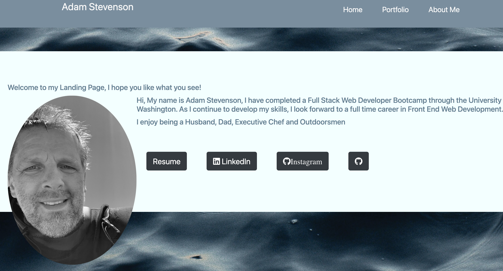

# Description
# [Deployed App](https://adams1971.github.io/React-Portfolio20/)
## React Portfolio

### This is the third version of my professional portfolio this time built using React. The user can move quickly from page to page and view content without loading a new page via the use of React Router. It showcases many of my project applications build while attending the UW Wed Dev Boot Camp. The first 3 projects on the portfolio page are team projects, the remaining are solo projects. 

#
## USAGE
* Go To insert io----
* From then Navbar, select Portfolio or About Me.
* In Portfolio you will see recent project in order of teams (first 3) and solo projects (remaining).
* Return to Home where you will find links to my Resume, LinkedIn, Instagram and Github pages.  
#
## UNDER CONSTRUCTION
You will notice at this time my About Me page is under construction
#
## QUESTION
I can be reached at (email) or (github)

#### [github](https://github.com/adams1971)

#### email: adamscdcm@gmail.com